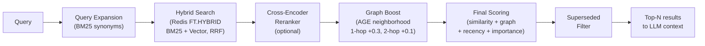

# agentmemory.md

Persistent memory for AI agents — semantic search, knowledge graph, and 22 MCP tools.

Works with any MCP-compatible agent: [Cursor](https://cursor.so), [Claude Desktop](https://claude.ai), [OpenClaw](https://github.com/openclaw/openclaw), and more.

**Repository:** https://gitlab.com/tonyzorin/agentmemory  
**Website:** https://agentmemory.md

---

[](cursor://anysphere.cursor-deeplink/mcp/install?name=agentmemory&config=eyJ0eXBlIjoic3RyZWFtYWJsZUh0dHAiLCJ1cmwiOiJodHRwOi8vJHtlbnY6QUdFTlRNRU1PUllfSE9TVH06ODA4MS9tY3AifQ==)
[](https://github.com/tonyzorin/agentmemory/raw/main/extension/agentmemory.mcpb)

> **Prerequisites:** Set `AGENTMEMORY_HOST` to your server's Tailscale IP before clicking "Add to Cursor":
> ```bash
> # Add to ~/.bashrc or ~/.zshrc
> export AGENTMEMORY_HOST=100.x.x.x
> ```
> Then restart Cursor and click the button. See [Connecting Agents](#connecting-agents) for full setup.

---

## The forgetting problem

Every session starts from zero. You re-explain the same project context. The agent re-asks questions you've already answered. It suggests approaches you already tried and rejected — without knowing why.

agentmemory.md gives your agent a brain that persists across every session and every tool:

- **Decisions with rationale** — the agent never re-asks "should we use Redis or Postgres?" when you settled that three weeks ago
- **Project context** — stack, repo path, deploy commands, environments — no more three-message warm-up
- **Failed experiments** — root causes stored and recalled before the agent suggests the same approach again
- **Goals and tasks** — the agent picks up exactly where you left off
- **People and relationships** — stakeholders, customers, collaborators — who owns what, what customers have said
- **Preferences and patterns** — coding style, tooling preferences, anti-patterns, reusable workflows

---

## How it works

### 1. Deploy

Run on any Linux box — a VPS, homelab server, or Proxmox LXC. One command starts everything:

```bash
docker compose up -d
```

### 2. Connect via Tailscale

Install Tailscale on your server and laptop. Your server gets a stable private IP (`100.x.x.x`). No port forwarding, no firewall rules — Tailscale encrypts everything at the network layer.

```bash
curl -fsSL https://tailscale.com/install.sh | sh
sudo tailscale up
tailscale ip -4  # note this IP

# Expose agentmemory to your tailnet (persists across reboots)
tailscale serve --bg --tcp 8081 tcp://localhost:8081
```

Port 8081 must not be open to the public internet — it has no authentication. `tailscale serve` binds port 8081 on your Tailscale IP so only devices in your tailnet can reach it — no firewall rules needed.

### 3. Add to your agent

Point Cursor, Claude Desktop, or any MCP-compatible agent at your server's Tailscale IP:

```json
{
  "mcpServers": {
    "agentmemory": {
      "url": "http://100.x.x.x:8081/mcp"
    }
  }
}
```

Plain HTTP is safe here — Tailscale handles encryption at the network layer.

### 4. Remember

Your agent now stores decisions, recalls context, tracks goals, and picks up exactly where you left off — across every session and every tool.

---

## Architecture

```
AI Agent (Cursor / Claude Desktop / OpenClaw / any MCP client)
    │
    ├─[MCP / HTTP]──► MCP Server (FastMCP v3)
    │                     │
    │                     ▼
    │              Memory Core Library
    │              ├── Embeddings (BAAI/bge-base-en-v1.5, 768-dim)
    │              ├── Hybrid Retrieval (Redis FT.HYBRID + AGE graph)
    │              └── Storage
    │                   ├── Redis 8.6 (FT.HYBRID: BM25 + vector, RRF fusion)
    │                   └── PostgreSQL 18 + Apache AGE 1.7.0 (graph)
    │
    └─[CLI]──────► memory store / recall / goal / task / ...
                   mem store / recall / ...  (short alias)
```

### Retrieval pipeline



The reranker is **disabled by default**. Enable it when your corpus exceeds ~1000 nodes or you need higher retrieval precision (see [Reranker](#reranker) below).

---

## System Requirements

Runs comfortably on a small VPS or homelab node.

| Component | Minimum |
|-----------|---------|
| CPU | 2+ cores — embeddings run on CPU, no GPU needed |
| RAM | 4 GB — PostgreSQL + Redis + embedding model |
| Disk | 2 GB for Docker images, grows with your memory corpus |
| OS | Any Linux with Docker — Ubuntu, Debian, Proxmox LXC |
| Network | Tailscale recommended for secure private access |

---

## Quick Start

```bash
# Start storage services
docker compose up -d

# Install
pip install -e .

# Store a memory
memory store "Anton prefers Claude for coding tasks" --tags preferences,tools

# Recall
memory recall "what does Anton prefer for coding"

# Get user profile
memory profile

# Stats
memory stats
```

---

## Connecting Agents

### Connect — Cursor IDE

Cursor supports the modern Streamable HTTP transport natively. In `~/.cursor/mcp.json`:

```json
{
  "mcpServers": {
    "agentmemory": {
      "url": "http://100.x.x.x:8081/mcp"
    }
  }
}
```

Replace `100.x.x.x` with your server's Tailscale IP.

---

### Connect — Claude Desktop

#### Option A — One-click Desktop Extension (recommended)

Download [`agentmemory.mcpb`](https://github.com/tonyzorin/agentmemory/raw/main/extension/agentmemory.mcpb) and double-click it. Claude Desktop will open an install dialog and prompt you for your server's Tailscale IP — no config file editing required.

Requires Claude Desktop 1.0.0 or later. See [Anthropic's Desktop Extensions docs](https://www.anthropic.com/engineering/desktop-extensions) for more detail.

#### Option B — Manual setup

Claude Desktop does not natively support Streamable HTTP. Use
[`mcp-remote`](https://www.npmjs.com/package/mcp-remote) as a bridge. In
`~/Library/Application Support/Claude/claude_desktop_config.json`
(macOS) or `%APPDATA%\Claude\claude_desktop_config.json` (Windows):

```json
{
  "mcpServers": {
    "agentmemory": {
      "command": "npx",
      "args": [
        "mcp-remote",
        "http://100.x.x.x:8081/mcp",
        "--allow-http"
      ]
    }
  }
}
```

Replace `100.x.x.x` with your server's Tailscale IP. The `--allow-http` flag is needed
because `mcp-remote` defaults to HTTPS — Tailscale traffic is already encrypted at the
network layer so plain HTTP is safe here.

Restart Claude Desktop after saving.

---

### Connect — OpenClaw

For OpenClaw (stdio mode), see [OPENCLAW_SETUP.md](OPENCLAW_SETUP.md).
For automatic recall/capture, see the [agentmemory-openclaw-plugin](https://gitlab.com/tonyzorin/agentmemory-openclaw-plugin).

---

## Agent Rules (v2026.03.15)

Ready-to-use rule files that teach your AI agent when to fetch and store memories.
Copy the one matching your client:

| Client | File | Install to |
|--------|------|------------|
| Cursor | [`rules/cursor.mdc`](rules/cursor.mdc) | `.cursor/rules/agentmemory.mdc` |
| Claude Code | [`rules/CLAUDE.md`](rules/CLAUDE.md) | Project root as `CLAUDE.md` |
| ChatGPT | [`rules/chatgpt-instructions.md`](rules/chatgpt-instructions.md) | Settings → Personalization → Custom Instructions |
| OpenClaw | [`rules/openclaw.md`](rules/openclaw.md) | See [OPENCLAW_SETUP.md](OPENCLAW_SETUP.md) |

These rules implement **tiered context fetching** — the agent loads only the memory
context needed for each request, from zero (bug fixes) to full profile (explicit memory
queries). See [AGENTS.md](AGENTS.md) for the full specification.

After copying, customize the project tags section for your own projects.

---

## Stack

| Component | Technology |
|-----------|-----------|
| Language | Python 3.14 |
| MCP Server | FastMCP v3 (Streamable HTTP on port 8081) |
| Vector Search | Redis 8.6 (FT.HYBRID: BM25 + vector, RRF fusion) |
| Knowledge Graph | PostgreSQL 18 + Apache AGE 1.7.0 |
| Embeddings | `BAAI/bge-base-en-v1.5` (768-dim, CPU, MTEB ~63) |
| CLI | Click + Rich (`memory` or `mem`) |

---

## Scoring

Every `memory_recall` result includes these fields:

| Field | Description |
|-------|-------------|
| `score` | Final combined score (0–1) |
| `similarity` | Normalized RRF score from Redis FT.HYBRID, or cross-encoder score if reranker is enabled |
| `reranker_score` | Cross-encoder score (0–1) — present only when reranker is enabled |
| `graph_boost` | +0.3 for 1-hop graph neighbors, +0.1 for 2-hop |
| `recency` | Exponential decay: 1.0 = just stored, ~0.5 = 29 days old |
| `importance` | Stored importance value (varies by node type) |

**Formula (similarity-adaptive):**
- Strong match (`similarity > 0.6`): `(sim×0.80 + graph×0.15 + recency×0.05) × importance_weight`
- Weak/medium match: `(sim×0.50 + graph×0.20 + recency×0.20 + importance×0.10) × importance_weight`

---

## Reranker

A cross-encoder reranker sits between hybrid search and the final scoring step. When enabled, it scores the top-K candidates jointly with the query, replacing the RRF similarity score with a more nuanced relevance score.

**Enable with:**
```bash
RERANKER_ENABLED=true
RERANKER_MODEL=cross-encoder/ms-marco-MiniLM-L6-v2  # default, CPU-feasible
RERANKER_TOP_K=20  # number of candidates to rerank
```

Or in docker-compose:
```yaml
environment:
  RERANKER_ENABLED: "true"
```

**Model choices:**
- `cross-encoder/ms-marco-MiniLM-L6-v2` — 22M params, ~50ms for top-20 on CPU, good quality (default)
- `cross-encoder/ms-marco-MiniLM-L12-v2` — 33M params, slightly better quality
- `BAAI/bge-reranker-v2-m3` — multilingual, strong MTEB scores

**When to enable:** Corpus of 1000+ nodes, or if you notice relevant memories being ranked below less-relevant ones. At small corpus sizes the improvement is marginal.

The model is lazy-loaded on first use and uses the same `sentence-transformers` dependency already in the stack — no new installs required.

---

## Knowledge Graph

17 node types: Memory, Learning, Decision, Goal, Initiative, Task, Project, Person,
ExternalContact, Preference, Environment, Tool, Workflow, Resource, Competitor, Metric,
CustomerFeedback

26 edge types: WORKS_ON, ABOUT, BELONGS_TO, FOR, ACHIEVED_VIA, BROKEN_INTO, TRACKS,
COMPETES_WITH, PREVENTED, **SUPERSEDES**, and more.

### Conflict resolution with SUPERSEDES

When a new memory contradicts or replaces an older one, mark the old one as superseded:

```python
# New memory that replaces an old one
result = memory_store("Anton switched to Rust for systems work", node_type="Preference")

# memory_store returns potential_conflict if a similar memory (0.75–0.92) already exists:
# {"id": "...", "potential_conflict": {"id": "<old-id>", "content": "Anton prefers Python..."}}

# Supersede the old one — it will be excluded from future search results
memory_supersede(new_id=result["id"], old_id="<old-id>")
```

Superseded nodes are kept in the graph for audit purposes but filtered from all `memory_recall` results.

---

## MCP Tools (22)

**Core memory:** `memory_store`, `memory_recall`, `memory_update`, `memory_relate`, `memory_context`, `memory_forget`, `memory_supersede`, `memory_entities`, `memory_split`, `memory_batch_update`, `memory_profile`

**Work structure:** `goal_manage`, `initiative_manage`, `task_manage`, `timeline`

**Knowledge:** `learning_store`, `workflow_store`

**Market intelligence:** `competitor_manage`, `metric_record`, `metric_query`, `customer_feedback_store`

---

## CLI Reference

`memory` and `mem` are interchangeable — `mem` is the short alias.

```bash
mem store "content" [--type Memory|Learning|Decision|...] [--tags tag1,tag2] [--importance 0.8]
mem recall "query" [--limit 10] [--type Memory]
mem profile [--no-recent] [--limit 20]
mem update <memory-id> [--content "..."] [--name "..."] [--tags tag1,tag2] [--importance 0.8]
mem forget <memory-id> [--yes]
mem learn "what failed" --what-failed "..." --why "..." --avoid "..."
mem decide "decision" --rationale "why"
mem goal create "name" [--project <id>]
mem goal list
mem initiative create "name" [--goal <id>]
mem task create "name" [--initiative <id>]
mem task done <task-id> [--summary "what was done"]
mem task list
mem relate <from-id> <to-id> <EDGE_TYPE>
mem context <entity-id> [--depth 2]
mem timeline [--since 7d] [--type Memory]
mem graph <entity-id> [--depth 2]
mem competitor add "name" [--website url] [--positioning "..."]
mem metric record "name" <value> [--type visitors] [--unit count]
mem metric query "name" [--since 30d]
mem workflow "name" "description" [--step "step 1"] [--step "step 2"]
mem split <memory-id> --chunk "fact 1" --chunk "fact 2"
mem batch-update --type Goal --importance 0.8
mem consolidate [--dry-run] [--no-dry-run] [--threshold 0.85] [--type Memory]
mem gc [--dry-run] [--type Task]
mem stats
mem export [-o backup.json]
mem import backup.json
```

### `memory consolidate` — merge near-duplicate nodes

Run periodically to keep the corpus clean as it grows:

```bash
# Preview what would be merged (safe — no changes)
memory consolidate

# Actually merge near-duplicates (asks for confirmation)
memory consolidate --no-dry-run

# More conservative threshold (only very close duplicates)
memory consolidate --no-dry-run --threshold 0.90

# Only consolidate Memory nodes
memory consolidate --no-dry-run --type Memory
```

The command groups semantically similar nodes into clusters and merges each cluster into its highest-importance node, preserving content and re-attaching graph edges.

---

## agentmemory.md vs a flat memory file

Many agent frameworks offer simple flat-file memory (a markdown file with notes). Here's an honest comparison:

| | Flat file | agentmemory.md |
|---|---|---|
| **Setup** | Zero — just a file | Docker + PostgreSQL + Redis |
| **Reliability** | Always works | Requires running services |
| **Corpus limit** | ~50–100KB before context overflow | Unlimited |
| **Retrieval at scale** | LLM reads everything (works well <100KB) | Hybrid search + graph boost (needed >100KB) |
| **Structure** | Unstructured text | Typed nodes, edges, relationships |
| **MCP API** | Agent edits text file (fragile) | 22 purpose-built tools |
| **Conflict handling** | Manual | SUPERSEDES edges + potential_conflict detection |
| **Maintenance** | None | `gc`, `consolidate`, `reindex` |

**Use a flat file when:** You have one project, short memory, and don't want infrastructure.  
**Use agentmemory.md when:** You have multiple projects, growing history, or want structured goal/task/decision tracking.

---

## Two ways to run it

**Self-hosted — Free**  
Open source. Your data stays on your server. Full control over every component. Docker Compose setup, all 22 MCP tools, CLI included, runs on any Linux box.

**Managed — Coming soon**  
Zero infrastructure. We run the server, handle updates, and keep your memory available everywhere. [Join the waitlist](https://agentmemory.md#waitlist).

---

## Running Tests

```bash
# Start services first
docker compose up -d

# Run all tests
pytest

# Run specific phase
pytest tests/test_redis_client.py -v
pytest tests/test_age_client.py -v
pytest tests/test_e2e.py -v
```
